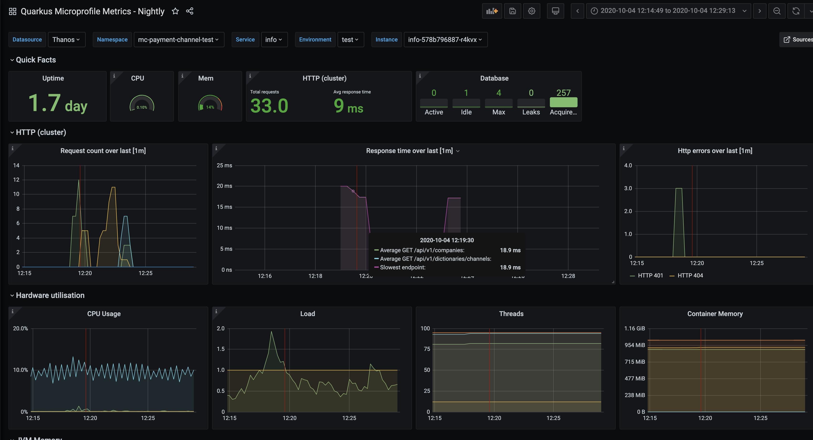

## Deploy Application with Docker-Compose

### Starting local Grafana and Prometheus
1. Run `docker-compose up -d`
2. Open `http://localhost:3000/` and use `admin:admin` credentials
3. Navigate into `http://localhost:3000/dashboards`
4. Open `Quarkus Microprofile Metrics` dashboard

### Following Containers will de deployed.

1. Application with Native Binary on `http://localhost:8080`
2. Prometheus for scraping metrics on `http://localhost:9090`
3. Grafana Dashboards for Quarkus on `http://localhost:3000`

### Available panels:
- Uptime
- Hardware utilization: CPU, mem, threads
- HTTP counters and timers
- Database (Agroal): connection pool counters and timers
- JVM memory and Garbage Collectors

Dashboards are from https://github.com/lwitkowski/quarkus-grafana-dashboard